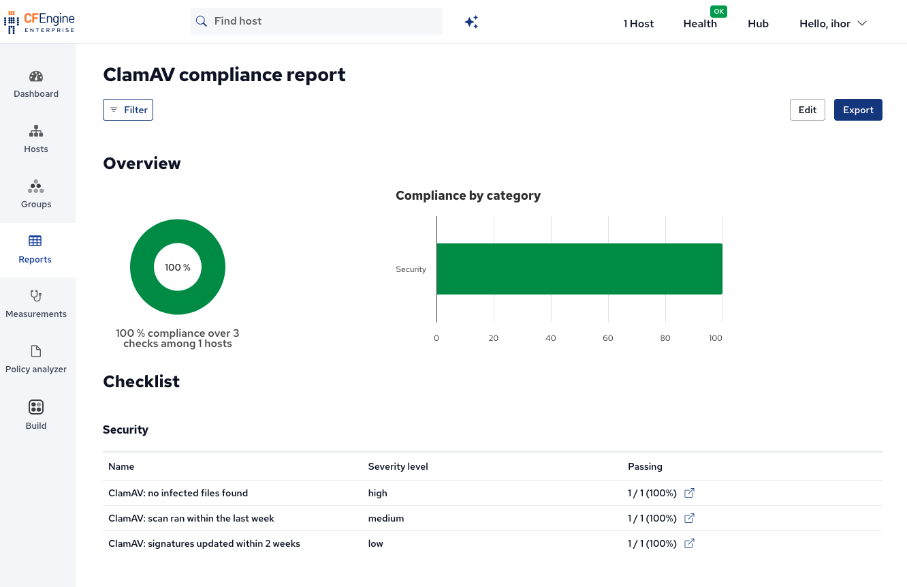

# ClamAV compliance report

A ready-made [Mission Portal compliance report](https://cfengine.com/blog/2022/compliance-report-based-on-inventory-modules/) built on the inventory attributes reported by this module.
This report will be automatically deployed via the [compliance-report-imports](https://build.cfengine.com/modules/compliance-report-imports/) dependency.

## Conditions

| Condition                                 | Severity | Passes when                                                           |
|-------------------------------------------|----------|-----------------------------------------------------------------------|
| ClamAV: no infected files found           | high     | The most recent scan reported its results and found 0 infected files. |
| ClamAV: scan ran within the last week     | medium   | A ClamAV scan completed on the host within the last 7 days.           |
| ClamAV: signatures updated within 2 weeks | low      | The virus signature database was updated within the last 14 days.     |

*Note*: Hosts that don't report ClamAV inventory at all (module not deployed, ClamAV not installed, no scan yet) fail all three conditions.
